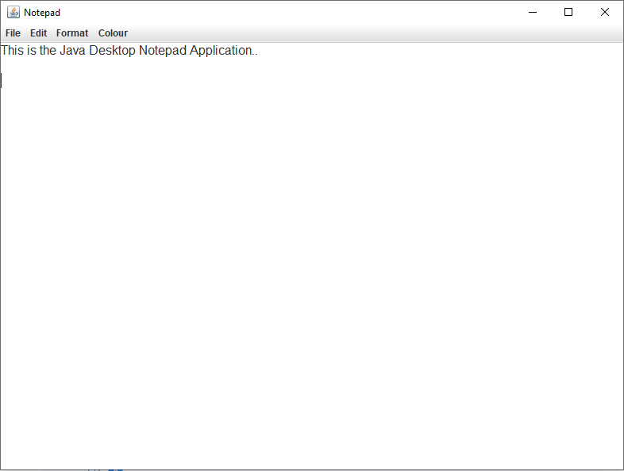
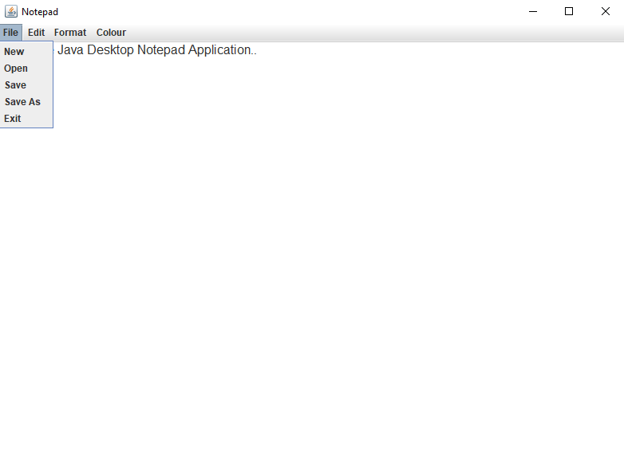
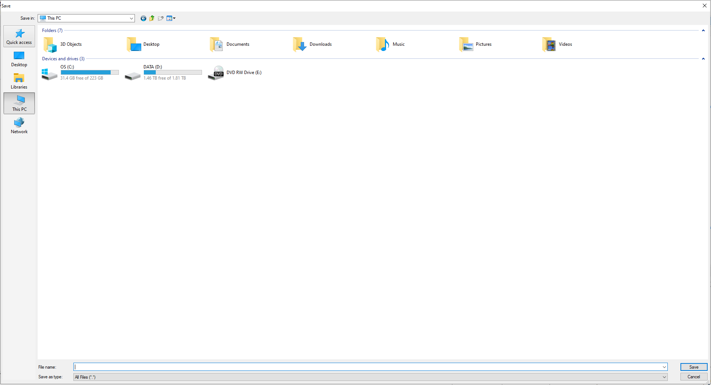

</a>

# Java Desktop Notepad Application

## Table of Contents

- [Java Desktop Notepad Application](#java-desktop-notepad-application)
  - [Table of Contents](#table-of-contents)
  - [Screenshot of the Application](#screenshot-of-the-application)
  - [Description](#description)
  - [Functionality](#functionality)
  - [KeyListener Functionality](#keylistener-functionality)
  - [Packages used within the Application](#packages-used-within-the-application)
  - [System requirements](#system-requirements)
  - [Source Code](#source-code)
  - [Running the application as an executable](#running-the-application-as-an-executable)

---

## Screenshot of the Application

 
 
  

## Description

GUI Notepad Desktop Application built using awt, swing and Jframe interfaces implementing UndoManager, ActionListener and ActionEvent.

The application is wrapped as an executable application (.exe) using Launch4j and ready to go.

## Functionality

- Menu
  - File
    - New
    - Open
    - Save
    - Save As
    - Exit
  - Edit
    - Undo
    - Redo
  - Format
    - Word Wrap
    - Font
    - Font Size
  - Colour
    - White
    - Black
    - Blue

## KeyListener Functionality

- Ctrl + S -> Save
- Ctrl + Z -> Undo
- Ctrl + Y -> Redo
- Alt + F -> Toggle Menu Bar

## Packages used within the Application

- import java.awt.event.ActionEvent;
- import java.awt.event.ActionListener;
- import javax.swing.BorderFactory;
- import javax.swing.JFrame;
- import javax.swing.JMenu;
- import javax.swing.JMenuBar;
- import javax.swing.JMenuItem;
- import javax.swing.JScrollPane;
- import javax.swing.JTextArea;
- import javax.swing.event.UndoableEditEvent;
- import javax.swing.event.UndoableEditListener;
- import javax.swing.undo.UndoManager;

## System requirements

- JavaSE-1.8 or higher.

## Source Code

The project was developed in Eclipse IDE and all source code and projects are uploaded as an Eclipse project for convenience.

- Source code is available to view in the src folder
- Compiled code located in the bin directory.
- Jar File
- Executable (.exe) File
- Doc's file (javadocs)

## Running the application as an executable

As the project has already been compiled into an executable file, all you need to is:

- download the project and run Java Desktop Notepad Application.exe
- all other files are not required unless you wish to inspect the source code.
